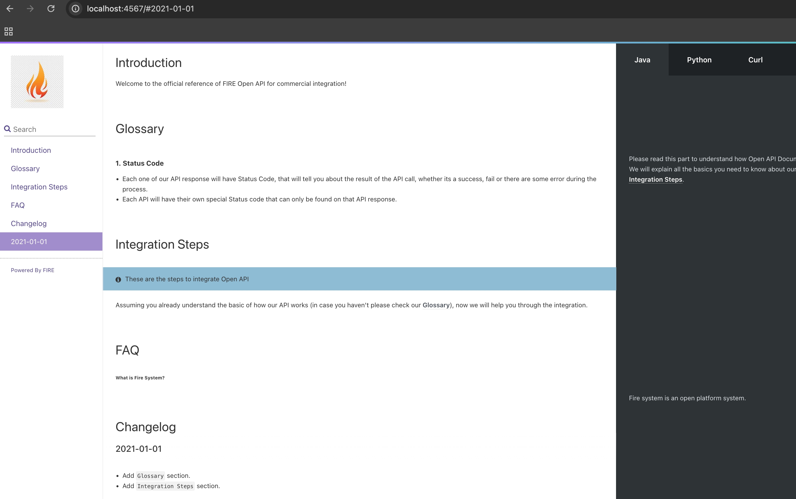

# open-api-document
> Open API Document System

# How to run in local environment?
- `cd {project root path}`
- `docker build -t shadowwalkerzh/open-api-document .`
- `docker run -d --rm --name open-api-document -p 4567:4567 -v $(pwd)/build:/app/build -v $(pwd)/source:/app/source shadowwalkerzh/open-api-document:latest`
- `docker exec -it open-api-document /bin/bash -c "bundle exec middleman build"`
- visit `http://localhost:4567`

# How to manage project version?
- Update the config in `VERSION` file
- Version includes 3 digits, each means major, minor and patch version

# How to deploy your development version and production version?
- Develop branch is for development, commit your code to develop branch and push to remote branch to build snapshot doc
- Master branch is for production, merge your code to master branch and push to remote branch to build release doc
- Don't forget to update your project version in `VERSION` file
- Don't forget to update your changelog section when updating your OPEN API document content

# References
- [Slate Github](https://slatedocs.github.io/slate)
- [Slate Live Demo](https://slatedocs.github.io/slate)
